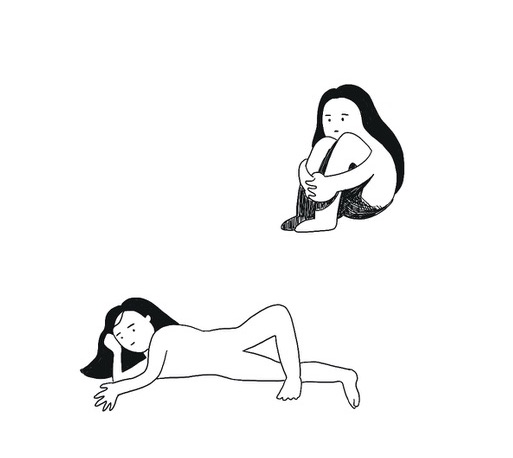

```js
💡 index.html로 open with live server로 화면과 함께 확인하면서 보세요.
```

---

1. transition으로 step별 움직임 효과 주기

```css
<div class='box' > </div > //
.box {
  width: 30px;
  height: 30px;
  background-color: grey;
}
.box:hover {
  background-color: hotpink;
  width: 120px;
  transition: all 1s 500ms steps(6);
  /* time 옵션을 2개 주면 뒤에 준 시간 뒤에 transition이 먹힘
    500ms 뒤에 1초에 걸쳐 6스텝으로 효과가 나타난다. */
}
```

---

2. 쉬운 탭 디자인 만들기

```css
<h3 class='title' > Fun CSS</h3 > //
.title {
  padding: 0.2em 0.5em;
  margin-top: 0;
  border-left: 10px solid hotpink;
  background: lightblue;
}
```

---

3. 글자에 그라디언트 넣기

```css
<h3 class='text-gradient' > Text Gradient</h3 > //

.text-gradient {
  margin-top: 0;
  background: linear-gradient(blue, red);
  -webkit-background-clip: text;
  -webkit-text-fill-color: transparent;
}
```

---

4. textarea 리사이즈 none

```css
<textarea > </textarea > // 

textarea {
  resize: none;
}
```

---

5. 화면 사이즈 넘어가는 텍스트를 알아서 줄바꿈

```css
<p class='wordWrap' > 화면 사이즈 넘어가는 텍스트를 알아서 줄바꿈 해주는 스타일. 화면을 리사이즈 해보세용. 용용용 </p > //

.wordWrap {
  word-wrap: break-word;
}
```

---

6. 문자열 첫글자만 스타일주기 + 첫번째 라인만 스타일 주기

- 화면이 좁아져서 줄바꿈 되는 되는 글자들에는 스타일이 사라짐.

```css
<p class='letter' > Bon's Fun CSSBon's Fun CSSBon's Fun CSSBon's Fun CSSBon's Fun CSSBon's Fun CSS</p > .letter::first-letter {
  font-size: 20px;
  font-weight: bold;
  color: royalblue !important;
}
.letter::first-line {
  color: pink;
}
```

---

7. 글자를 넣지 않은 빈 div에만 따로 스타일을 줄 수 있음.

```css
<div class='emptyBox' > not Empty</div > //
<div class='emptyBox' > </div> //
<div class='emptyBox' > not Empty</div > //

.emptyBox {
  background: saddlebrown;
  color: white;
  padding: 10px;
}
.emptyBox:empty {
  background: wheat;
}
```

---

8. firt-of-type 연습! content 밑에 p타입의 첫번째 아이에게 스타일주기

```css
<div id="content"> //
    <h3>title</h3> //
    <p>aaa</p>     //
    <p>bbb</p>     //
    <p>ccc</p>     //
</div>//

#content p:first-of-type {
  color: violet;
}
```

---

9. text-shadow 주기

```css
<p class="sd">Hello BON!</p> //

.sd {
  text-shadow: 5px 5px yellowgreen;
}
```

10. list 스타일 포지션 + 마커 스타일

```css
<ul class="lsp"> //
  <li class="bg">list1</li> //
  <li class="bg">list2</li> //
  <li class="bg">list3</li> //
</ul> //

.bg {
  background: goldenrod;
}
.bg::marker {
  color: green;
}
.lsp {
  list-style-position: inside;
}
```

---

11. 문장 들여쓰기

```css
<p class="ti">hi</p> ///
<p>my name is</p> ///
<p>someone</p> ///

.ti {
  text-indent: 10px;
}
```

---

12. 글자 뒤집기

```css
<p class="wm">ABC</p> //

.wm {
  writing-mode: vertical-lr;
}
```

---

13. zoom으로 요소 확대하기

```css
<div class="zoom"></div>   //
<div class="zoom z"></div> //

.zoom {
  width: 50px;
  height: 50px;
  background: green;
  margin-bottom: 4px;
}
.z {
  zoom: 130%;
}
```

---

14. 애니메이션

```css
<h2 class="ani">WOW</h2> //
<hr />                  //
색깔 체인지 애니메이션        //
<div class="changeColor"></div> //

.ani {
  margin-top: 0;
  animation-duration: 3s;
  animation-name: slide;
}
@keyframes slide {
  from {
    margin-left: 100%;
  }
  to {
    margin-left: 0%;
  }
}

.changeColor {
  width: 50px;
  height: 50px;
  border: solid 1px;
  animation-duration: 3s;
  animation-name: changeCl;
}
@keyframes changeCl {
  0% {
    background: gold;
  }
  50% {
    background: black;
  }
  100% {
    background: lightcoral;
  }
}
```

---

15. scss의 extend기능을 사용하여 스타일 주기

```css
<div class="box1"></div> //
<div class="box2"></div> //
<div class="box3"></div> //

%t {
  width: 50px;
  height: 50px;
  border: 1px solid black;
  margin-bottom: 4px;
}

.box1 {
  @extend %t;
  background: blanchedalmond;
}

.box2 {
  @extend %t;
  background: cadetblue;
}
.box3 {
  @extend %t;
  background: chocolate;
}
```

---

16. @supports 사용해보기

- 브라우저가 display grid를 support하는지 안 하는지에 따라
  각기 다른 효과를 줄 수 있다!

```css
<div class="supports">  //
    <div></div>         //
    <div></div>         //
</div>                  //

.supports {
  div {
    width: 50px;
    height: 50px;
    margin-bottom: 4px;
    background: blueviolet;
  }
}
@supports (display: grid) {
  .supports {
    display: grid;
  }
}
@supports not (display: grid) {
  .supports {
    display: flex;
  }
}
```

---

17. scroll-snap-type 사용해보기

- 한 화면에 꽉 차는 div가 세로 또는 가로로 여러개 있을 때,
- 스크롤 했을 시 div가 잘리지 않고 바로 다음 div로 깔끔하게 스크롤링 되도록 하는 기능.

- key point는 부모 요소에 `scroll-snap-type` 을, 자식 요소에 `scroll-snap-align` 를 설정해주는 것.

```css
<div class="scroll-container">            //
    <div class="item scroll-area">1</div> //
    <div class="item scroll-area">2</div> //
    <div class="item scroll-area">3</div> //
    <div class="item scroll-area">4</div> //
    <div class="item scroll-area">5</div> //
    <div class="item scroll-area">6</div> //
    <div class="item scroll-area">7</div> //
    <div class="item scroll-area">8</div> //
</div>                                    //

.scroll-container,
.scroll-area {
  width: 150px;
  height: 150px;
}
.scroll-container {
  overflow: auto;
  /* ADD THIS TO THE PARENT */
  scroll-snap-type: y mandatory;
}
.item {
  /* ADD THIS TO THE CHILD */
  scroll-snap-align: center;
  display: inline-block;
  display: flex;
  justify-content: center;
  align-items: center;
  font-size: 38px;
}

.item:nth-child(odd) {
  background: chocolate;
}
.item:nth-child(even) {
  background: cornflowerblue;
}
```

---

18. is seudo selector 사용해보기

- 선택자를 깔끔하게 작성하는 방법.

```css
<header>                //
    <nav>               //
    <button></button>   //
    </nav>              //
    <button></button>   //
</header>               //

/* 이 코드를 :is를 사용해 더 깔끔하게 작성하면 */
header button,
nav button {
  width: 60px;
  height: 20px;
  background-color: tomato;
}

/* 이렇게 할 수 있다! */
/* header, nav있어? 그럼 그 밑에 button 선택할게 */
:is(header, nav) button {
  width: 60px;
  height: 20px;
  background-color: tomato;
}
```

---

19. 이미지나 비디오의 비율을 정할 수 있는 aspect-ratio 사용해보기

```css
 //

.exp {
  width: 100px;
  aspect-ratio: 16 / 9;
  // aspect-ratio: 1 / 1; /* width and height are equal proportion */
  // aspect-ratio: 2 / 1; /* width is twice the height*/
  // aspect-ratio: 1 / 2; /* width is half the height */
  // aspect-ratio: 16 / 9  /* typical video aspect ratio */
  // aspect-ratio: auto 4 / 3; /* width:height, unless it's a replaced element */
}
```

---

20. sticky 활용해서 유저의 스크롤을 따라다니는 header 만들기

```css
<div id="container2">      //
  <section>                //
    <aside>Header</aside>  //
  </section>               //
  <section>                //
    <aside>Header</aside>  //
  </section>               //
  <section>                //
    <aside>Header</aside>  //
  </section>               //
  <section>                //
    <aside>Header</aside>  //
  </section>               //
</div>                     //

#container2 {
  width: 150px;
  height: 400px;
  overflow: auto;
  section {
    background-color: tomato;
    /* 2. 정의된 높이가 있는 컨테이너 안에 그 요소를 넣으면 된다! */
    height: 70%;
    width: 100%;
    margin: 35px 0px;
    display: flex;
    justify-content: flex-end;
  }
  aside {
    background-color: teal;
    height: 50px;
    width: 100%;
    /* 1. 원하는 요소에 position sticky를 넣고 */
    position: sticky;
    top: 0px;
    text-align: center;
    color: white;
    display: flex;
    align-items: center;
    justify-content: center;
  }
}
```
